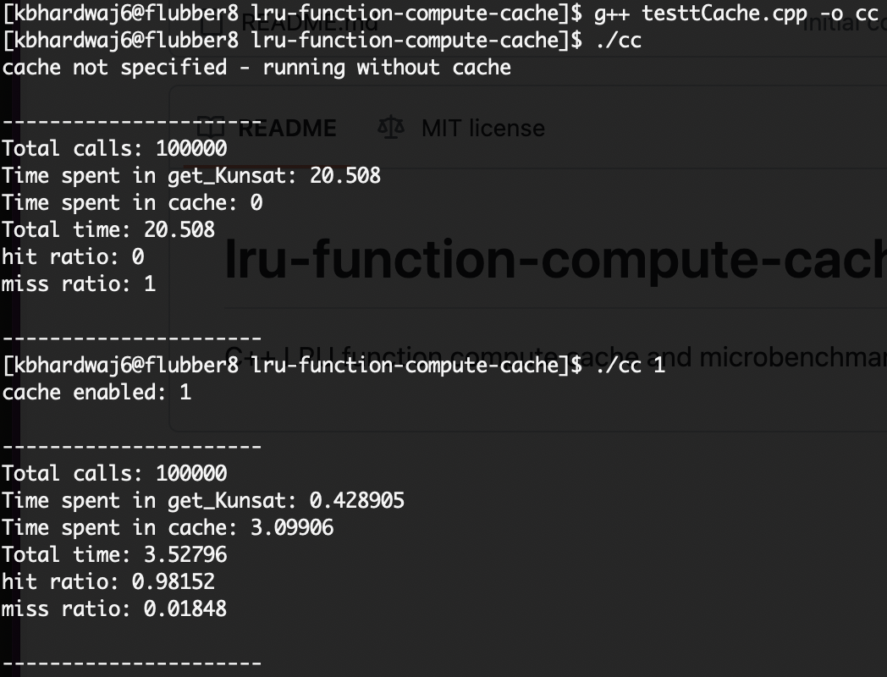

# tCache benchmark - Implementation of LRU Cache to cache function computation in tRIBS

## Clone

```git clone https://github.com/gt-sse-center/lru-function-compute-cache.git```

## Files

- tCache.h : Header only implementation of LRU cache
- testtCache.cpp: Implementation of microbenchmark to compare cached vs. normal function
- calltrace.txt: Dump of function input parameters and output of the function

## Building
```$ g++ testtCache.cpp -o cc```

## Running 

- with cache disabled

```$ ./cc``` 

- with cache enabled

```$ ./cc 1```

Sample Output:

<p align="center">
    
</p>
